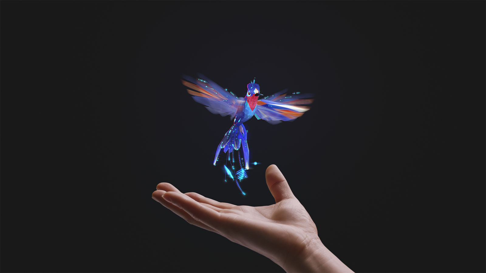

# Azure Mixed Reality Curriculum

## How to use this book?

This book is designed as a collection of classes that starts from basic concepts and builds a project over time. Each lesson can also be used as an individual workshop. Each class follow the below structure:

* **Core concepts** and discussion points.
* **Project** step by step walk-through.
* **What could go wrong** section to discuss the common mistakes and issues.
* Further reading **resources**.

Each class have **questions** as sections and builds the part of the project related to the question. If you feel comfortable to answer a question, feel free to move on to the next question or the next class. 

If you have any questions, suggestions and improvements, please [**submit an issue**](https://help.github.com/en/github/managing-your-work-on-github/creating-an-issue) here: [https://github.com/Yonet/AzureMixedRealityDocs/issues](https://github.com/Yonet/AzureMixedRealityDocs/issues).

Hope you enjoy developing your mixed reality application!

## Lessons

* [Lesson 1](lessons/lesson1/): Introduction to Mixed Reality Applications and Development.
* [Lesson 2](lessons/lesson-2.md): Introduction to Mixed Reality Developer Tools and 3D Concepts.
* [Lesson 3](lessons/lesson-3/): Working with Hand Interactions.
* [Lesson 4](lessons/lesson-4.md): Eye and Head Gaze Tracking.
* [Lesson 5](lessons/lesson-5.md): Spatial Visualization using Bing Maps.
* [Lesson 6](lessons/lesson-6/): Working with REST APIs.
* [Lesson 7](lessons/lesson-7/): Azure Spatial Anchors and Backend Services.
* [Lesson 8](lessons/lesson-9.md): Working with QR codes.
* [Lesson 9](lessons/lesson-8.md): Displaying Spatial Anchors on a map.
* [Lesson 10](lessons/lesson-11.md): Getting Started with AI.
* [Lesson 11](lessons/lesson-10.md): Working with Scene Understanding
* [Lesson 12](lessons/lesson-12.md): Project Discussion and Case Studies.

