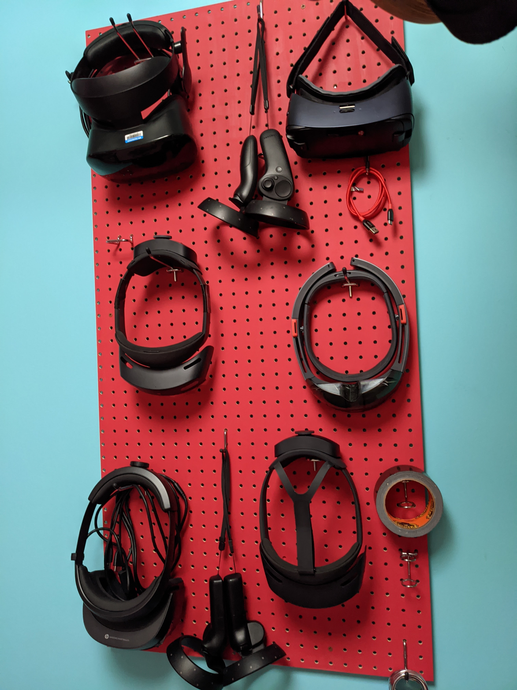
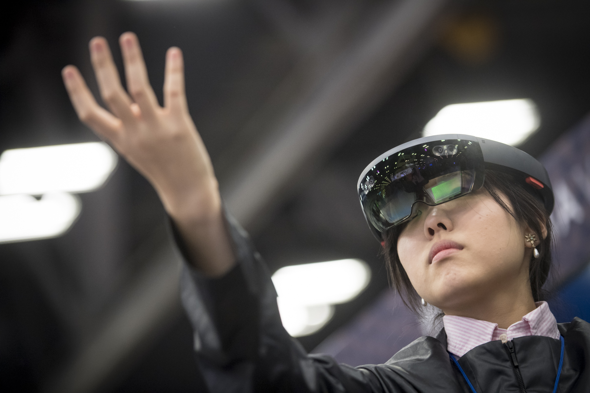
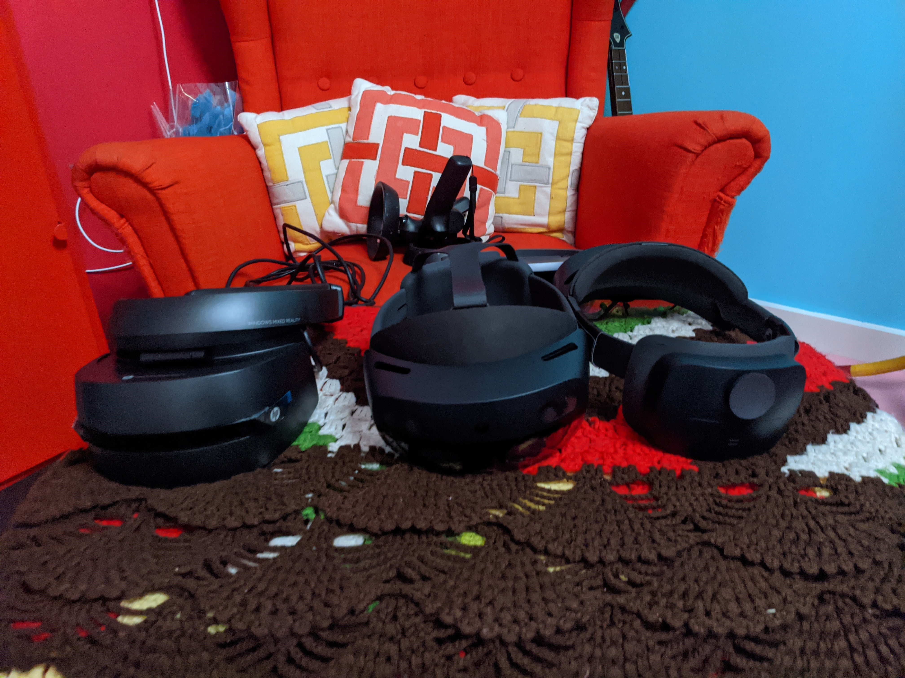
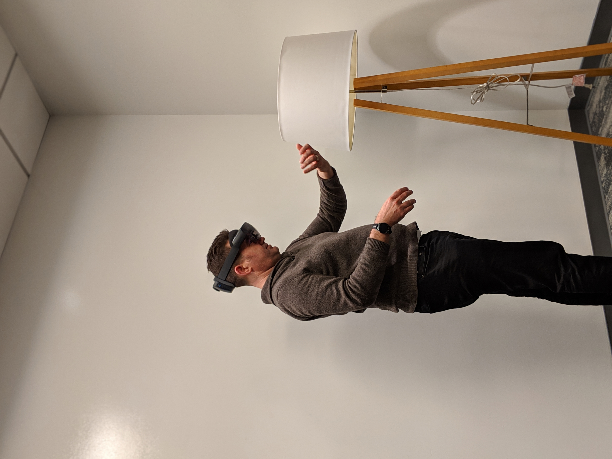

# How to improve Model performance?

Getting the best model performance for your business can be a rather iterative process. Results can vary depending on the customizations you make to the model, and the training data you provide.

To help facilitate this process, **AI Builder** allows you to have **multiple versions of your model** so you can use your model and continue to improve it at the same time.

### What are some best practices for training for object detection?

* **Use diverse images** to train with all possible use cases. For example if you are training your data to detect a VR headset, use images of the headset used in different environments as well as the out of the box images. If you only train with images with people wearing the headset, your model would not recognize images of the same device when it is in it's box.

* Use images with variety of **backgrounds.** Photos in context are better than  photos in front of the neutral backgrounds.

* Use training images that have different **lighting**. For example, include images images taken with flash, high exposure, and so on.

* Use images of objects in varied sizes. Different sizing helps the model generalize better.
* Use images taken from different **angles**. If all your photos are from a set of fixed cameras such as surveillance cameras, assign a different label to each camera. This can help avoid modeling unrelated objects such as lampposts as the key feature. Assign camera labels even if the cameras capture the same objects.

### How to share your models?

By default, only you can see the models you create and publish. This feature allows you to test them and use them within apps and flows without exposing them.

If you want others to use your model, you can share it with specific users, groups, or your whole organization.

