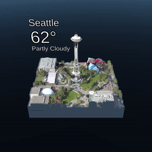
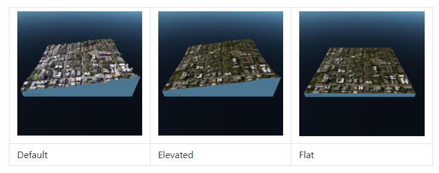

# Lesson 5

## Concepts

### Why is spatial data important?

### What are some good spatial visualizations for Mixed Reality?

### What is Bing Maps SDK?



## Project

### How to include Bing Maps SDK into your project?

### How to sign up as a developer for Bing Maps?

### How to create and configure your first map in unity?

### How to style your map using render settings?

### What is a Map Terrain Type?



### How to add hand interactions for scaling and rotation?

### How to style bounding box?

### How to add a slider for lat-long input?

### How to animate your map?

### How to add Pins to your map?

There are 2 ways to add Pins to your map. First, you can directly attach a MapPin component to your Map GameObjects which you want to attach to the MapRenderer at a specific lat-lon. When attached, the MapRenderer will take over positioning of the MapPin's Transform component.

### How to add pins using tthe MapPinLayer?

This approach is better suited for large data sets where clustering may be required:

* Add a `MapPinLayer` component to the MapRenderer's GameObject. If clustering is enabled, check this setting on the layer and attach a prefab that has a ClusterMapPin component.


 In a script, get a reference to the `MapPinLayer` and add `MapPin` instances to the the layer's `MapPins` collection.

```text
foreach (var mapPinLocation in _maoPinLocations)
{
    var mapPin = Instantiate(_mapPinPrefab);
    mapPin.Location = mapPinLocation;
    _mapPinLayer.MapPins.Add(mapPin);
}​

```

### How to add labels to your map?

### How to customize the map texture?

## What could go wrong?

### Does the dimensions of the map effect performance?

Larger map dimensions will require more data to be downloaded and rendered. This will affect the overall performance of the app. It is recommended to stay with the default settings or smaller, or only increase the map dimensions on devices that are capable. Regardless, the map dimensions are clamped to a maximum size.

### Does Map Terrain Type effect performance?

 The `Flat` map terrain type requires the least amount of performance overhead. Both elevation and high resolution 3D models are disabled. The map terrain surface will be flat.

### Can I customize the materials and shaders? 

It is possible to replace the material used for either the terrain or the clipping volume wall.

When doing this, it is recommended to make a copy of the base shaders, which are imported as part of the NuGet package under _lib\unity\map\Resources_. Use the copies made of these shaders as the starting point for new materials.

 Importantly, the `ENABLE_ELEVATION_TEXTURE` keyword used by the shaders will need to be maintained. Certain draw calls for the terrain require an elevation texture while others do not.

### Can quality settings effect the performance?

It is important to note that the level of detail offset can have a large impact on performance. The trade-off being higher quality will come with a higher performance impact where the cache size will grow more quickly. Lowering the quality may be beneficial on devices that are performance constrained.

