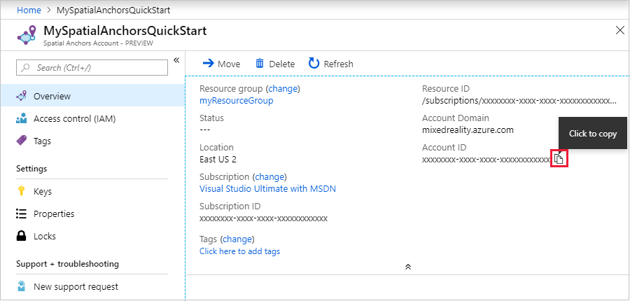
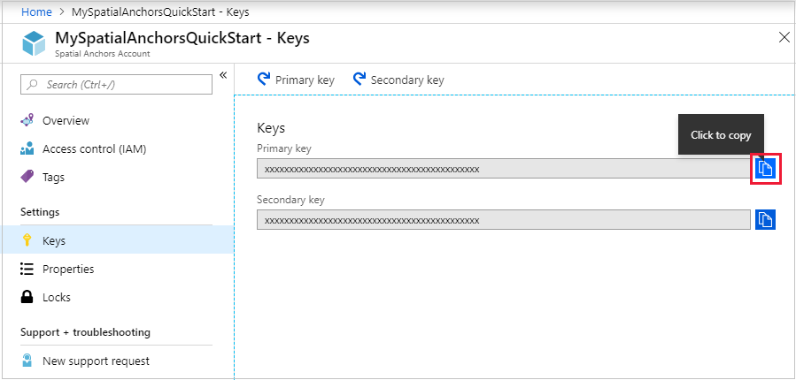
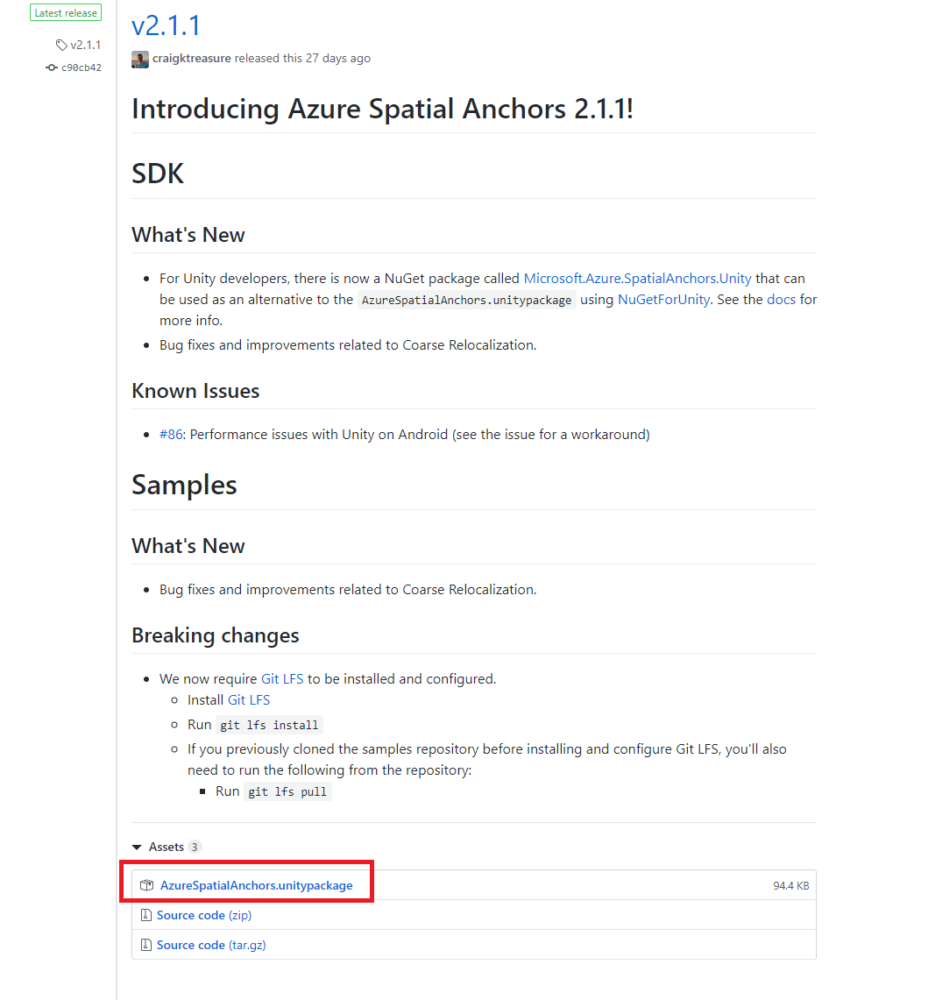
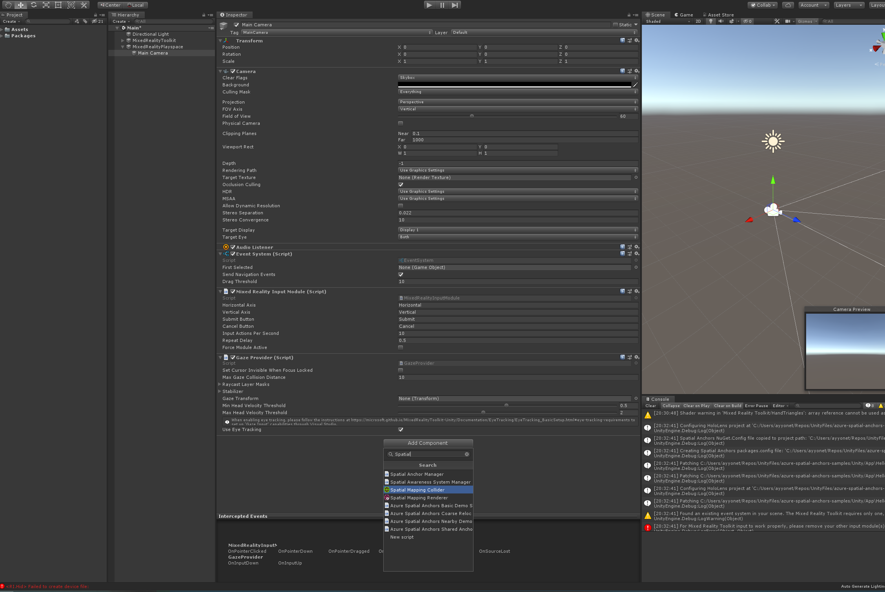
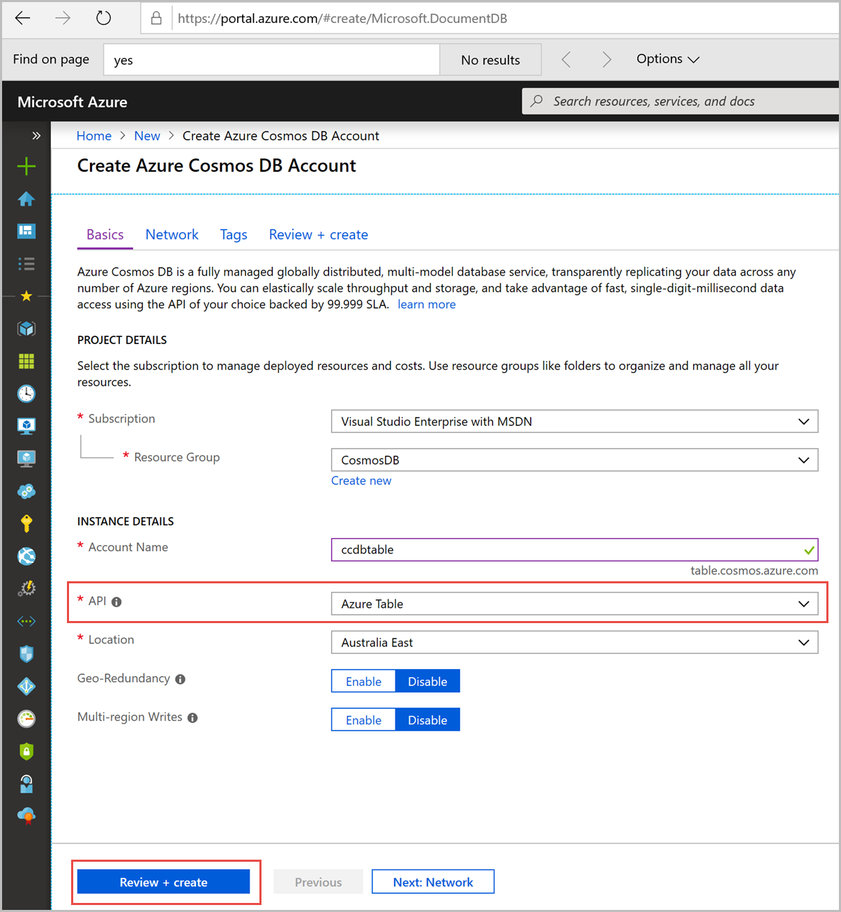
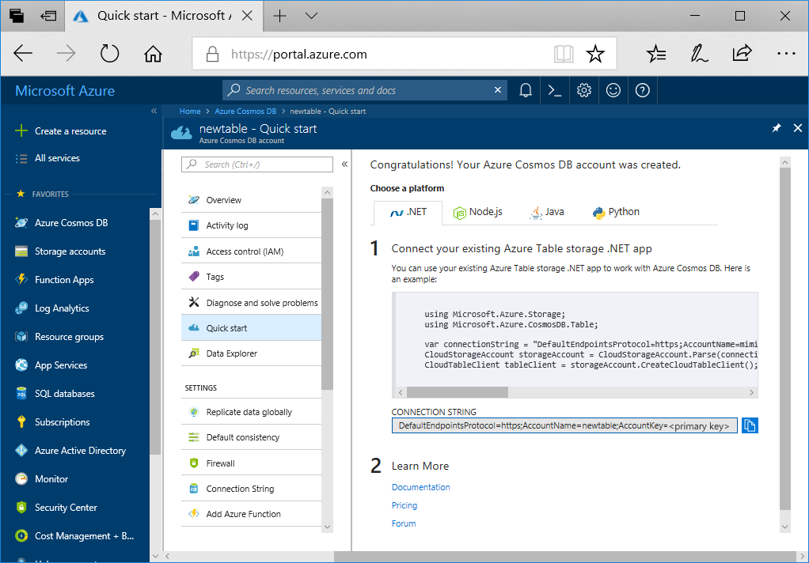

# Lesson 7

## Concepts

### What is a Spatial Anchor?

 Spatial Anchors allows you to place virtual object in a specific place in your real world. Spatial Anchors are available in iOS, Android and HoloLens headsets. [Azure Spatial Anchors](https://docs.microsoft.com/azure/spatial-anchors/overview?WT.mc_id=talksAndWorkshops-github-ayyonet) gives you a way to save and share anchor points in space, so that you can share the virtual objects or information between multiple devices and persist them over time.

### Why use Spatial Anchors? 

Using [Azure Spatial Anchors](https://docs.microsoft.com/azure/spatial-anchors/overview?WT.mc_id=github-mixedrealitycurriculum-ayyonet) allow you to share any information in specific context, time and space. Some of the use cases are having user guides of machinery, inventory information, [way-finding applications](https://docs.microsoft.com/azure/spatial-anchors/concepts/anchor-relationships-way-finding?WT.mc_id=github-mixedrealitycurriculum-ayyonet), educational applications, multi-player games. Having smartphones and having access to the GPS data changed the apps we build and enabled ride sharing and location based recommendation applications. Developing with Azure Spatial Anchors will help you deliver contextual data at the right time and place and will open up new possibilities indoors.

###  **Which devices does Azure Spatial Anchors support?**

Azure Spatial Anchors enables developers to build apps on [HoloLens](https://docs.microsoft.com/azure/spatial-anchors/quickstarts/get-started-hololens?WT.mc_id=github-mixedrealitycurriculum-ayyonet), on[ iOS ](https://docs.microsoft.com/azure/spatial-anchors/quickstarts/get-started-ios?tabs=openproject-swift&WT.mc_id=github-mixedrealitycurriculum-ayyonet)devices with ARKit support, and on [Android](https://docs.microsoft.com/azure/spatial-anchors/quickstarts/get-started-android?tabs=openproject-java&WT.mc_id=github-mixedrealitycurriculum-ayyonet) devices with ARCore support; for iOS and Android this includes both phones and tablets. 

### What do I need to do to make sure Android, iOS and HoloLens are using the same point as my anchor?

[To share Azure Spatial Anchors](https://docs.microsoft.com/azure/spatial-anchors/tutorials/tutorial-share-anchors-across-devices?tabs=VS%2CAndroid&WT.mc_id=github-mixedrealitycurriculum-ayyonet), SDK translate the local Spatial Anchor data into Azure Spatial Anchor format and saves it. Similarly, when a different platform asks for the same Spatial anchor data, the device will receive the anchor in platform's format. 

## Project

### How to sign up for Azure Student Account?

* Go to [Azure For Students page.](https://azure.microsoft.com/en-us/free/students/?WT.mc_id=github-mixedrealitycurriculum-ayyonet)
* Follow the Activate Now link.

### How to create an Azure Spatial Anchor resource?

* Go to[ Azure Portal](%20https://portal.azure.com/?WT.mc_id=github-mixedrealitycurriculum-ayyonet).
* In the left navigation pane in the Azure portal, select **Create a resource**.
* Use the search box to search for **Spatial Anchors**.


* Select **Spatial Anchors**. In the dialog box, select **Create**.
* In the **Spatial Anchors Account** dialog box:
  * Enter a unique resource name, using regular alphanumeric characters.
  * Select the subscription that you want to attach the resource to.
  * Create a resource group by selecting **Create new**. Name it **myResourceGroup** and select **OK**. A [resource group](https://docs.microsoft.com/en-us/azure/azure-resource-manager/management/overview#terminology?WT.mc_id=github-mixedrealitycurriculum-ayyonet) is a logical container into which Azure resources like web apps, databases, and storage accounts are deployed and managed. For example, you can choose to delete the entire resource group in one simple step later.
  * Select a location \(region\) in which to place the resource.
  * Select **New** to begin creating the resource.
*  After the resource is created, Azure Portal will show that your deployment is complete. Click **Go to resource**.


*  Then, you can view the resource properties. Copy the resource's **Account ID** value into a text editor because you'll need it later.



*  Under **Settings**, select **Key**. Copy the **Primary key** value into a text editor. This value is the `Account Key`. You'll need it later.



### How to include Azure Spatial Anchors\(ASA\) SDK to your project?

* Go to [Azure Spatial Anchors samples repo](https://github.com/Azure/azure-spatial-anchors-samples?WT.mc_id=github-mixedrealitycurriculum-ayyonet), [releases tab](https://github.com/Azure/azure-spatial-anchors-samples/releases?WT.mc_id=github-mixedrealitycurriculum-ayyonet).
* Scroll down to assets section and click on AzureSpatialAnchors.unitypackage to download.
* In your Unity project select Assets &gt; Import package &gt; custom package and find the downloaded AzureSpatialAnchors.unitypackage and import all.



### How to create a Azure Spatial Anchor app and configure scene?

* Start your project from [UnitySeedProject](lesson1.md#how-to-get-started-with-hololens-seed-project).
* Work on main scene or[ create a new scene](lesson1.md#how-to-create-a-new-scene) and [configure your scene with MRTK](lesson1.md#how-to-configure-a-new-scene-with-mrtk).
*  In the **Publishing Settings** Configuration section, check **InternetClientServer** and **SpatialPerception**.
* Add Spatial Mapping Collider component to your camera.



### How to add ASA script to your scene?

* Create a new script called AzureSpatialAnchorsScript.
* Add imports:

```csharp
using System;
using System.Collections.Generic;
using System.Threading.Tasks;
using UnityEngine;
using UnityEngine.XR.WSA;
using UnityEngine.XR.WSA.Input;
```

* Add the following members variables into your AzureSpatialAnchorsScript class:

```csharp
public class AzureSpatialAnchorsScript : MonoBehaviour
{   
    /// <summary>
    /// The sphere prefab.
    /// </summary>
    public GameObject spherePrefab;

    /// <summary>
    /// Set this string to the Spatial Anchors account id provided in the Spatial Anchors resource.
    /// </summary>
    protected string SpatialAnchorsAccountId = "Set me";

    /// <summary>
    /// Set this string to the Spatial Anchors account key provided in the Spatial Anchors resource.
    /// </summary>
    protected string SpatialAnchorsAccountKey = "Set me";

    /// <summary>
    /// Use the recognizer to detect air taps.
    /// </summary>
    private GestureRecognizer recognizer;

    /// <summary>
    /// True if we are 1) creating + saving an anchor or 2) looking for an anchor.
    /// </summary>
    protected bool tapExecuted = false;

    /// <summary>
    /// The ID of the CloudSpatialAnchor that was saved. Use it to find the CloudSpatialAnchor
    /// </summary>
    protected string cloudSpatialAnchorId = "";

    /// <summary>
    /// The sphere rendered to show the position of the CloudSpatialAnchor.
    /// </summary>
    protected GameObject sphere;
    protected Material sphereMaterial;

    /// <summary>
    /// Indicate if we are ready to save an anchor. We can save an anchor when value is greater than 1.
    /// </summary>
    protected float recommendedForCreate = 0;
```

### How to update the UI when a callback resolves?

When working with Unity, all Unity APIs, for example APIs you use to do UI updates, need to happen on the main thread. In the code we'll write however, we get callbacks on other threads. We want to update UI in these callbacks, so we need a way to go from a side thread onto the main thread. To execute code on the main thread from a side thread, we'll use the dispatcher pattern.

* Let's add a member variable, dispatchQueue, which is a Queue of Actions. We will push Actions onto the queue, and then dequeue and run the Actions on the main thread.

```csharp
/// <summary>
/// Set this string to the Spatial Anchors account key provided in the Spatial Anchors resource.
/// </summary>
protected string SpatialAnchorsAccountKey = "Set me";

/// <summary>
/// Our queue of actions that will be executed on the main thread.
/// </summary>
private readonly Queue<Action> dispatchQueue = new Queue<Action>();

/// <summary>
/// Use the recognizer to detect air taps.
/// </summary>
private GestureRecognizer recognizer;
```

* Next, let's add a way to add an Action to the Queue. Add `QueueOnUpdate()` right after `Update()` :

```csharp
/// <summary>
/// Queues the specified <see cref="Action"/> on update.
/// </summary>
/// <param name="updateAction">The update action.</param>
protected void QueueOnUpdate(Action updateAction)
{
    lock (dispatchQueue)
    {
        dispatchQueue.Enqueue(updateAction);
    }
}
```

* Let's now use the Update\(\) loop to check if there is an Action queued. If so, we will dequeue the action and run it.

```csharp
// Update is called once per frame
void Update()
{
    lock (dispatchQueue)
    {
        if (dispatchQueue.Count > 0)
        {
            dispatchQueue.Dequeue()();
        }
    }
}
```

### How to initialize a CloudSpatialAnchorSession?

* Import AzureSpacialAnchors asset into your script.

```csharp
using Microsoft.Azure.SpatialAnchors;
```

*  Add the CloudSpatialAnchorSession and CloudSpatialAnchor member variables into your `AzureSpatialAnchorsScript` class:

```csharp
/// <summary>
/// Use the recognizer to detect air taps.
/// </summary>
private GestureRecognizer recognizer;

protected CloudSpatialAnchorSession cloudSpatialAnchorSession;

/// <summary>
/// The CloudSpatialAnchor that we either 1) placed and are saving or 2) just located.
/// </summary>
protected CloudSpatialAnchor currentCloudAnchor;

/// <summary>
/// True if we are 1) creating + saving an anchor or 2) looking for an anchor.
/// </summary>
protected bool tapExecuted = false;
```

* Initialize Session:

```csharp
/// <summary>
/// Initializes a new CloudSpatialAnchorSession.
/// </summary>
void InitializeSession()
{
    Debug.Log("ASA Info: Initializing a CloudSpatialAnchorSession.");

    if (string.IsNullOrEmpty(SpatialAnchorsAccountId))
    {
        Debug.LogError("No account id set.");
        return;
    }

    if (string.IsNullOrEmpty(SpatialAnchorsAccountKey))
    {
        Debug.LogError("No account key set.");
        return;
    }

    cloudSpatialAnchorSession = new CloudSpatialAnchorSession();

    cloudSpatialAnchorSession.Configuration.AccountId = SpatialAnchorsAccountId.Trim();
    cloudSpatialAnchorSession.Configuration.AccountKey = SpatialAnchorsAccountKey.Trim();

    cloudSpatialAnchorSession.LogLevel = SessionLogLevel.All;

    cloudSpatialAnchorSession.Error += CloudSpatialAnchorSession_Error;
    cloudSpatialAnchorSession.OnLogDebug += CloudSpatialAnchorSession_OnLogDebug;
    cloudSpatialAnchorSession.SessionUpdated += CloudSpatialAnchorSession_SessionUpdated;

    cloudSpatialAnchorSession.Start();

    Debug.Log("ASA Info: Session was initialized.");
}
```

* Add methods to handle delegate calls.

```csharp
private void CloudSpatialAnchorSession_Error(object sender, SessionErrorEventArgs args)
{
    Debug.LogError("ASA Error: " + args.ErrorMessage );
}

private void CloudSpatialAnchorSession_OnLogDebug(object sender, OnLogDebugEventArgs args)
{
    Debug.Log("ASA Log: " + args.Message);
    System.Diagnostics.Debug.WriteLine("ASA Log: " + args.Message);
}

private void CloudSpatialAnchorSession_SessionUpdated(object sender, SessionUpdatedEventArgs args)
{
    Debug.Log("ASA Log: recommendedForCreate: " + args.Status.RecommendedForCreateProgress);
    recommendedForCreate = args.Status.RecommendedForCreateProgress;
}
```

Call the InitializeSession method inside the Start\(\) function:

```csharp
// Start is called before the first frame update
void Start()
{
    recognizer = new GestureRecognizer();

    recognizer.StartCapturingGestures();

    recognizer.SetRecognizableGestures(GestureSettings.Tap);

    recognizer.Tapped += HandleTap;

    InitializeSession();
}
```

### How to save the new CloudSpatialAnchor as a WorldAnchor on the local platform?

Attach a local Azure Spatial Anchor to the sphere that we're placing in the real world.

```csharp
/// <summary>
/// Creates a sphere at the hit point, and then saves a CloudSpatialAnchor there.
/// </summary>
/// <param name="hitPoint">The hit point.</param>
protected virtual void CreateAndSaveSphere(Vector3 hitPoint)
{
    // Create a white sphere.
    sphere = GameObject.Instantiate(spherePrefab, hitPoint, Quaternion.identity) as GameObject;
    sphere.AddComponent<WorldAnchor>();
    sphereMaterial = sphere.GetComponent<MeshRenderer>().material;
    sphereMaterial.color = Color.white;
    Debug.Log("ASA Info: Created a local anchor.");

    // Create the CloudSpatialAnchor.
    currentCloudAnchor = new CloudSpatialAnchor();

    // Set the LocalAnchor property of the CloudSpatialAnchor to the WorldAnchor component of our white sphere.
    WorldAnchor worldAnchor = sphere.GetComponent<WorldAnchor>();
    if (worldAnchor == null)
    {
        throw new Exception("ASA Error: Couldn't get the local anchor pointer.");
    }

    // Save the CloudSpatialAnchor to the cloud.
    currentCloudAnchor.LocalAnchor = worldAnchor.GetNativeSpatialAnchorPtr();
}
```

### [How to create a CosmosDB table to save and share the anchors between devices?](https://docs.microsoft.com/azure/spatial-anchors/tutorials/tutorial-use-cosmos-db-to-store-anchors?source=docs&WT.mc_id=github-mixedrealitycurriculum-ayyonet)

* Sign in to your Azure Portal
* Create a resource by selecting Databases &gt; Azure CosmosDB


* Select the subscription  and resource group you are using for this project.
* Enter a unique name to identify Azure Cosmos DB account.
* Select **"Azure Table"** as the **API**.
* Select a geographic location to host your Azure Cosmos DB account. Use the location that's closest to your users to give them the fastest access to data.
* You can leave the **Geo-Redundancy** and **Multi-region Writes** options at their default values \(**Disable**\) to avoid additional RU charges. You can skip the **Network** and **Tags** sections.
* Select **Review+Create**. After the validation is complete, select **Create** to create the account.



*  It takes a few minutes to create the account. You'll see a message that states **Your deployment is underway**. Wait for the deployment to finish and then select **Go to resource**.



* Copy the `Connection String` for later use.
* Open `SharingService\Startup.cs.`
* Locate `#define INMEMORY_DEMO` at the top of the file and comment that line out. Save the file.
* Open `SharingService\appsettings.json`.
* Locate the `StorageConnectionString` property, and set the value to be the same as the `Connection String` value.

