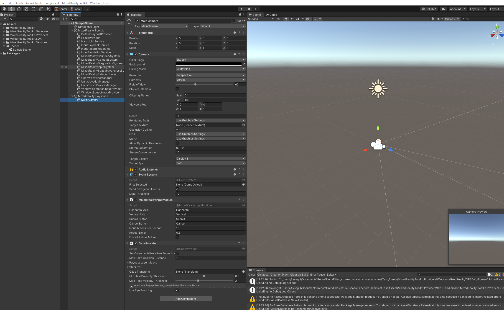

# How to add Mixed Reality Toolkit\(MRTK\) to a project?

If you are using HoloLens Seed project, you do not need to follow this step. **Seed project already comes with MRTK**. Still it's good to know how to import the MRTK assets for your future projects. 

First, you need to download MRTK by going to their github page: [aka.ms/MRTKGithub](https://aka.ms/MRTKGithub) and navigating to **releases tab**. Scroll down to **Assets** section and download the tools:

* Examples
* Extensions
* Foundation 
* Tools

## Add MRTK assets into your project

In your Unity project, select **Assets tab** and select **Import Package &gt; Custom Package** from the drop down.

Navigate to MRTK downloaded folders to select and import them into your project. 

Once you have MRTK assets imported, a new tab called Mixed Reality Toolkit will appear in your Unity editor. Navigate to new tab and select **Add Scene and Configure** from the dropdown menu. In your Scene Hierarchy, a new **MixedRealityToolkit** and **MixedRealityPlayspace** dropdowns will appear. 

MixedRealityPlayspace now includes your **Main Camera** and the camera is configured for Mixed Reality applications. Camera background is black to render transparent and **MixedRealityInputModule**, **EventSystem**, **GazeProvider** components are now added to your camera. 


You can create a new scene to compare the camera settings that has changed by MRTK.


* You might be prompted to select a **configuration**. You can choose the **default MRTK configuration** or if you are developing for an HoloLens device, you can choose the configuration for the appropriate version.

